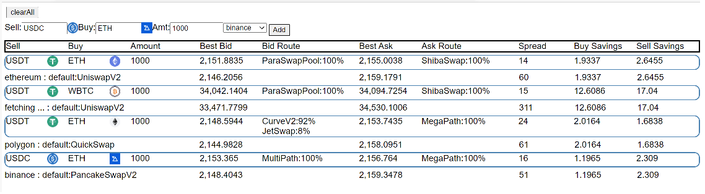

# ParaSwap API Best Hack :  ETH CC Hackathon 2021

## Summary

Use the ParaSwap API to get and display information about token pairs:

- Bid, Ask prices at the given amount
- The best route found
- Comparison to a default route on each exchange
- Spread of bid and ask 
- Value of price improvement

### Default Routes

Default routes are currently hard coded as:

- ethereum: UniswapV2
- polygon: QuickSwap
- Binance: default:PancakeSwapV2

### Sample Screen Shot

### Try it here

[on netlify](https://main--zealous-bose-9b0a85.netlify.app/)

### Development

### Prerequisites

- nodejs
- yarn
### Build it

`yarn start`

